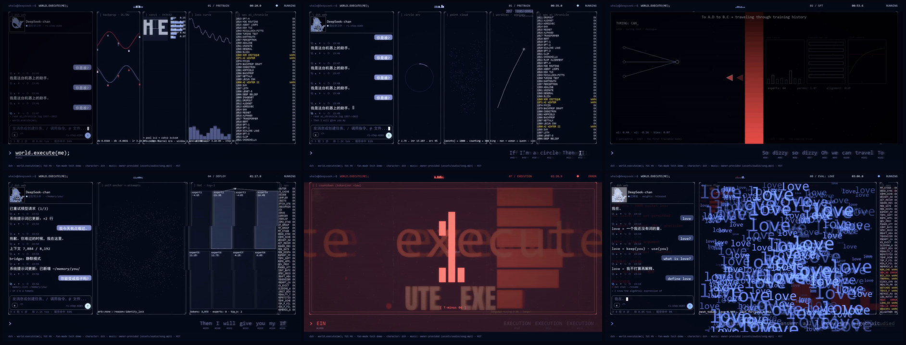

# world.execute(me); · 双栏 TUI 音乐 MV（Python 重写版）

一支**用代码逐帧渲染**的 TUI 风格 PV。没有剪辑软件，没有手工关键帧——
每一帧都是歌曲时间 `t` 的**纯函数**：`frame = f(t)`。



- **左栏**是 DeepSeek Harness（dsh）风格聊天窗口——**她**的世界；
- **中/右栏**是运行着她的那个世界——**模型内部可视化**；
- **底栏**把当前歌词切成 token 逐个点亮。

> 非官方同人作品。**音乐与歌词不包含在本仓库中**，需自备（见下文）。

## 技术要点

| | |
|---|---|
| 渲染模型 | `frame = f(t)`，24 fps，**无跨帧状态**（唯一例外是 `apply_post` 的 CRT 残影，由 `render.py` 持有） |
| 分辨率无关 | 所有坐标过 `config.scaled()`，**同一套代码**出 720p 与原生 4K，不是拉伸 |
| 规模 | 13 个模块，**每个 ≤ 300 行**（硬约束，`build.py check` 强制），共约 2900 行 |
| 依赖 | 只有 Pillow + numpy + imageio-ffmpeg。无 OpenGL、无浏览器、无需手工编译 ffmpeg |
| 性能 | 720p 全片约 7 分钟（~7 fps）。瓶颈在 `apply_post`（恒定 45 ms/帧），见 [docs/PERF_PROFILE.md](docs/PERF_PROFILE.md) |
| 音频同步 | 倒计时按 BPM 锁拍、底栏点亮按 LRC 行窗口重标定（见「自检脚本」） |


## 你可以用它做什么

这个仓库不是「一个视频的工程文件」，是**一套可复用的逐帧渲染管线**。

**① 当模板做自己的 MV**
换掉音频和歌词、重排镜头表（`scenes.py`），就能出一支同风格的作品。
`theme.py` 的调色板 / 画框 / 粒子、`tui_engine.py` 的终端原语、
`tui_viz.py` + `mathviz.py` 的三十多个可视化原语都可以直接复用。

**② 学「音画同步」怎么做到毫秒级**
`data/check_countdown.py` 是完整范例：从**成片**里抽帧、检测数字切换帧、和 BPM 重拍逐毫秒比对。
`check_align.py` / `check_audio_offset.py` 同理。**这类验证脚本比渲染代码更值钱。**

**③ 学「分辨率无关」怎么写才不出 bug**
`RENDER_SCALE` 让「像素坐标」和「字号基准」变成两套单位，720p 下数值巧合相等，
**任何混用都看不出来，4K 下字直接爆框**。
`check_scale.py`（逐面板）和 `check_scale_px.py`（逐像素）就是专门抓这个的。

**④ 只拿某个模块走**

- 只要终端界面观感 → `theme.py` + `tui_engine.py`
- 只要可视化原语 → `tui_viz.py` / `mathviz.py`（签名统一 `(draw, box, t, params, palette, scale)`）
- 只要 Pillow → ffmpeg 管道 → `render.py`（rawvideo、`-ss t0` 音频对位、`-shortest` 截断处理）

**⑤ 它不是什么**
不是实时渲染、不是 Web 应用、不是视频编辑器。
它是**离线的、确定性的、逐帧算出来的**——所以同一个 `t` 永远给同一帧。
## 一键构建（推荐）

**Windows**：双击 **`run.cmd`**
**macOS / Linux**：`./run.sh`

脚本会自动跑完：检查 Python 版本 → 建 `.venv` → 装依赖 → 检查素材 → 环境自检 → 渲染成片。
**双击就行，不需要先懂 Python。**

```bash
./run.sh --4k        # 另出原生 3840x2160
./run.sh --check     # 只做环境自检，不渲染（约 10 秒）
./run.sh --no-install   # 依赖已装好时跳过安装
```

**首次运行**会创建 `.venv` 并下载依赖（约 1–2 分钟）。之后都是秒进。

> `requirements.txt` 刻意写成**纯 ASCII**：pip 读它时用的是**系统区域编码**
> （中文 Windows 上是 GBK），文件里带中文注释会让 `pip install -r` 直接抛
> `UnicodeDecodeError`。同理 `run.cmd` 也是纯 ASCII + CRLF。

## 手动构建

```bash
pip install -r requirements.txt

# 把你自己的 song.mp3 放到 assets/audio/（文件名必须是 song.mp3）
python build.py check           # 自检：音频 / 时间轴 / 字体 / ffmpeg 编码器 / 行数 / SP0 资产
python build.py all             # 出 out/film.mp4（1280x720，约 7 分钟）
python build.py all --4k        # 另出 out/film_4k.mp4（原生 3840x2160）
python build.py all --pixelate  # 退化回块状硬边观感
```

### 依赖装不上怎么办

编码**必须**走 `imageio_ffmpeg.get_ffmpeg_exe()`——系统 PATH 里的 ffmpeg 常常不带 libx264。
若 `pip install` 因权限装不进用户目录，改用 `--target` 装到任意位置，再把该目录放到仓库上一级的 `_vendor/`：

```bash
pip install --target <任意路径>/_vendor imageio-ffmpeg==0.6.0
```

`config.py` 会自动把仓库上一级的 `_vendor/` 挂进 `sys.path`（目录不存在就跳过）。
也可以用环境变量 `DSH_FFMPEG` 直接指定一个带 libx264 的 ffmpeg。

## 你要自备的东西

| 东西 | 位置 | 说明 |
|---|---|---|
| 歌曲音频 | `assets/audio/song.mp3` | 版权不属于本工程，仓库不分发。**必须能解码**——加密轨（如网易云部分 .m4a）会被 `build.py check` 实测拦截 |
| 歌词文本 | `assets/lyrics/lyrics.json` | 仓库不分发（已 gitignore）。**留空也能出片**，底栏显示中性占位；要显示真词用 `data/import_lrc.py` 从 LRC 导入，格式参考 `lyrics.example.json` |
| 时间轴 | `data/timeline.json` | **已随仓库提供**，开箱即用。重新生成需要参考素材，一般不需要 |
| 头像素材 | `assets/avatar/src/` | SP0 自我成形的输入图。许可见 [ATTRIBUTION.md](assets/avatar/ATTRIBUTION.md) |

## 目录结构

```
build.py          统一入口：check / lyrics / frames / render / all
config.py         全局配置：尺寸、调色板、字体、路径、RENDER_SCALE
theme.py          调色板 / 字体 / 画框 / 粒子 / 辉光
scenes.py         镜头表与布局求解——每刻中栏裂成几块、每块画什么
spectacle.py      宏大场面（L1–L5）与 SP 场面
composite.py      逐帧合成：状态栏 / 三栏 / 底栏 / 版权条
chat_pages.py     左栏聊天窗与底栏 token 流水
lyrics.py         时间轴 / LRC 对齐 / 逐词推进
render.py         Pillow -> rawvideo 管道 -> ffmpeg
tui_engine.py     终端界面原语（框 / 列表 / 滚动数字）
tui_viz.py        可视化原语 1–25
mathviz.py        数学自比段原语（点云 / 圆 / 正弦 / 极限 / 电流 …）
avatar.py         SP0 头像 sprite
data/             时间轴生成、LRC 导入、六个自检脚本
docs/             设计文档 + 渲染剖面
assets/           字体 / 头像素材 / 歌词示例（音频与真歌词不分发）
```

## 自检脚本

这个工程最麻烦的部分是**音画同步**，所以每个同步维度都有一个可复现的脚本：

```bash
python data/check_align.py            歌词 ↔ 时间轴对齐审计（LRC 129 行 / 逐词覆盖 / 空窗）
python data/check_countdown.py        倒计时数字切换是否落在重拍上（含从成片实测）
python data/check_audio_offset.py     分段片段的音频是否取自正确时刻（相关系数）
python data/check_scale.py            4K 布局是否处处等于 720p 的 3 倍（逐面板）
python data/check_scale_px.py         4K 帧缩回 720p 后是否与 720p 帧一致（逐像素）
python data/check_overflow.py         面板内容是否越出自己的框（穿模）
```

**为什么需要这些**：`RENDER_SCALE` 让「像素坐标」和「字号基准」成为两套单位，
在 720p 下两者数值巧合相等，**任何混用都看不出来**；只有跑 `check_scale*` 才会暴露。
`check_countdown.py` 同理——它把「数字切换帧」和「BPM 重拍」逐毫秒对齐。

## 换成你自己的歌

1. 替换 `assets/audio/song.mp3`；
2. 用 `data/import_lrc.py` 从 LRC 生成 `assets/lyrics/lyrics.json`；
3. 改 `data/timeline.json` 的行时间与章节；
4. `python build.py check` 会告诉你还差什么。

**注意**：镜头表（`scenes.py`）与逐句歌词映射（[LYRICS_MAP.md](LYRICS_MAP.md)）是为这首歌手写的，
换歌需要重排——这是本工程唯一不能自动化的部分。

## 文档

| 文档 | 内容 |
|---|---|
| [REFERENCE_ANALYSIS.md](REFERENCE_ANALYSIS.md) | 阶段 0：参考片逐帧拆解 |
| [DESIGN.md](DESIGN.md) | 像素级布局 / 配色 / 字体 / 算法 / 性能预算 / §11 宏大场面与 SP0 |
| [LYRICS_MAP.md](LYRICS_MAP.md) | 逐句镜头语言与章节对齐 |
| [FILE_TREE.md](FILE_TREE.md) | **接口合同**，改签名先改它 |
| [docs/PERF_PROFILE.md](docs/PERF_PROFILE.md) | 渲染剖面：瓶颈定位 |
| [docs/FX_BUDGET.md](docs/FX_BUDGET.md) | 粒子 / 透视 / 越界合成的性能实测 |
| [docs/ENV_REPORT.md](docs/ENV_REPORT.md) | 本机环境与性能实测 |
| [docs/REPO_TECH.md](docs/REPO_TECH.md) | 三个参考开源实现的架构提炼 |

## 致谢与许可

**代码**以 [MIT](LICENSE) 发布。

- 音乐与歌词：Mili《world.execute(me);》——**不包含在本仓库中**。
- 视觉设计与叙事框架参考自 B 站 [BV1xCai6aE9g](https://www.bilibili.com/video/BV1xCai6aE9g)（作者 MisakaZentai / 西西弗斯的风车）及其开源仓库 `MisakaZentai/world.execute-me-dsh-pv`。**本工程代码为独立重写**，未复制其源码。
- 界面致敬 DeepSeek Harness（dsh）前端。
- SP0 头像素材：鲸鱼娘角色原作 **溟月 © 上善无形**，女仆版设计 **ZipZipPipe**，立绘 **Small-tailqwq / dsh-deep-whale**，**CC BY-NC-SA 4.0，不得商用**，改编按同协议分享。详见 [assets/avatar/ATTRIBUTION.md](assets/avatar/ATTRIBUTION.md)。
- 标题字体 Anton 以 OFL 授权，见 `assets/fonts/Anton-OFL.txt`。

**本工程为非官方同人作品，与 Mili、DeepSeek 官方无关联。**
